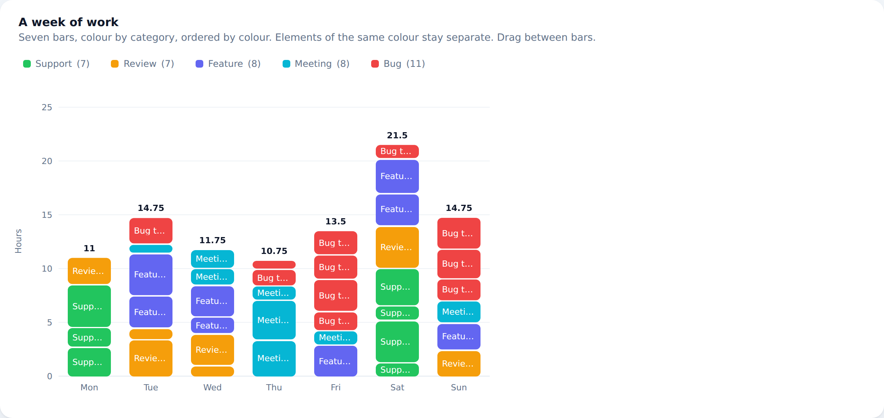
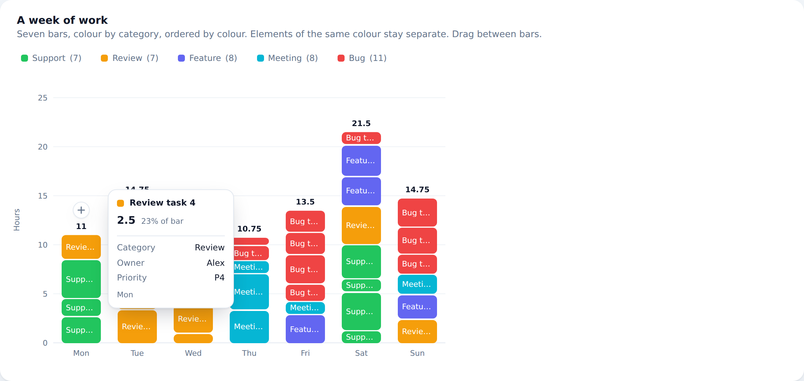
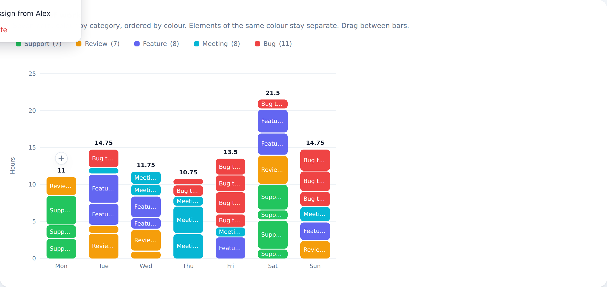
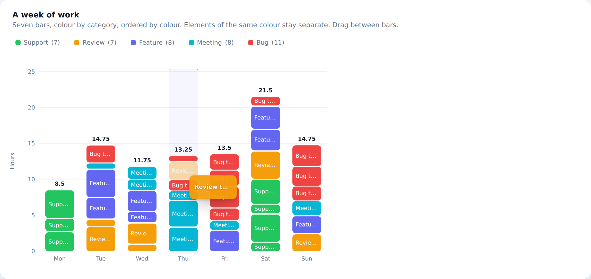
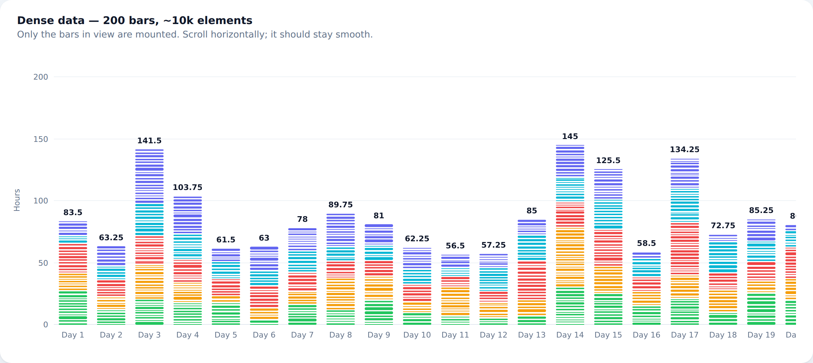

# Stacked Bar Chart — Mendix pluggable widget

A modern, animated stacked bar chart that is also an editing surface: click an
element to act on it, add elements from a button on top of each bar, and drag
elements between bars.



## What it does

| | |
|---|---|
| **Per-element colour** | Any CSS colour, from an expression, an attribute, or an automatic palette keyed on a series attribute. |
| **Elements never merge** | Every Mendix object is its own element. Two adjacent elements of the same colour stay two elements. |
| **Multi-key sorting** | Order elements inside a bar by colour and by any attributes you add, in any combination. |
| **Hover tooltip** | Configurable fields, plus the value and its share of the bar. |
| **Element menu** | Your own action items, each receiving the clicked element as its microflow parameter. |
| **Add button** | A circled **+** above every bar, firing a single action or opening a menu of them. |
| **Drag and drop** | Between bars and within a bar, with optional confirmation. |
| **Large data sets** | Only the bars on screen are mounted. 200 bars and 10,000 elements render 23 bars and ~900 nodes. |

## Requirements

Mendix **10.24** or later, including Mendix 11. The floor is set by action
variables, which the widget uses to give a microflow the context of a bar — a
bar is a grouping the widget computes, so unlike an element it is not a Mendix
object that could be passed as a parameter.

## Installation

Drop `com.dynamicchart.StackedBarChart.mpk` into your project's `widgets`
folder and synchronise the App Directory (**F4**).

To build it yourself:

```bash
npm install
npm run build     # development bundle in dist/
npm run release   # production bundle (~43 KB)
```

## Getting started

The minimum configuration is three properties:

1. **Elements** — a list of the objects to draw.
2. **Bar key** — the attribute that says which bar an element belongs to.
   Elements sharing a value are stacked together.
3. **Value** — how tall the element is.

Everything else has a working default. Colour defaults to a single fallback
colour until you set a colour source, and elements are ordered by colour.

### Colours

`Colour source` chooses where the colour comes from:

- **Expression** — e.g. `if $Booking/Status = 'Done' then '#22c55e' else '#f59e0b'`.
- **Attribute** — a string attribute already holding a CSS colour, which is the
  usual choice when colours are maintained in their own table.
- **Automatic palette** — pick a **series attribute** and each distinct value
  gets a palette colour.

Set the **series attribute** whatever the colour source is: it is what names the
colours in the legend. Without it the legend falls back to an element's label,
which names one element rather than the group.

### Sorting inside a bar

`Sort keys` is a list applied in order. Each key sorts by **colour** or by an
**attribute** you nominate, ascending or descending. With no keys configured,
elements are ordered by colour.

Sorting is type-aware, which matters more than it sounds:

- Enumerations sort in their **declared order**, not alphabetically by caption,
  so `Low, Medium, High` comes out in that order.
- Decimals are compared exactly rather than converted to floating point.
- Strings use a locale-aware, natural-number comparison, so `item 2` precedes
  `item 10`.
- Empty values sort last in both directions.
- The data source order is always the final tiebreaker, so the result is stable.

### Tooltip



Add rows under **Tooltip fields**: a caption and a text template. Field
expressions are evaluated only for the element actually under the cursor, so a
tooltip with five fields costs nothing until something is hovered.

### Element menu



Add rows under **Menu items**. Each has a caption, an optional icon, a
visibility expression, a style, and an action. The action is bound to the
elements data source, so the clicked element arrives as the microflow or
nanoflow parameter — which is how "change the value" is implemented: point the
item at a microflow, or at a page that edits the element.

### Adding elements

The circled **+** sits above each bar. What it calls depends on how bars are
configured:

- **With a bars data source** — `Add action (bars list)` receives the **bar
  object**, so the microflow can create the element and associate it directly.
- **Without one** — `Add action` receives the bar context as action variables:

  | Variable | Type | Meaning |
  |---|---|---|
  | `barKey` | String | The bar key, as text |
  | `barIndex` | Integer | Position of the bar in the chart |
  | `insertIndex` | Integer | Where the new element goes — the top of the stack |
  | `barTotal` | Decimal | The bar's current total |

  Studio Pro surfaces these when the action is *Call a microflow* or *Call a
  nanoflow*; they are ignored for *Open page*.

Set **On click** to *Open a menu of actions* to offer several kinds of element
("Add booking", "Add absence", …) instead of one.

### Drag and drop



Enable **Drag and drop** and choose how the move is persisted. The two
mechanisms compose:

**A sequence attribute.** The widget writes the new position itself, using a
fractional index halfway between the two neighbours, so a reorder writes one
element rather than renumbering the bar. It renumbers only when repeated
halving runs out of floating-point precision.

**An `On drop` action.** It receives the dragged element as its parameter plus:

| Variable | Type | Meaning |
|---|---|---|
| `sourceBarKey` / `targetBarKey` | String | Bar moved from and to |
| `sourceIndex` / `targetIndex` | Integer | Position moved from and to |
| `previousElementGuid` | String | The element that will sit **below** it |
| `nextElementGuid` | String | The element that will sit **above** it |

The neighbour ids are there so a microflow can insert between two specific rows
even when its own sort order differs from the chart's.

> **Reordering inside a bar only sticks if the sort configuration allows it.**
> The order inside a bar comes from the sort keys. If you want drag to
> reposition elements within a bar, set a sequence attribute **and add it as a
> sort key**. Otherwise the sort puts the element straight back where it was on
> the next refresh. Studio Pro warns about this. Moving an element to a
> *different* bar always works, whatever the sort.

**Confirmation** is off, a built-in dialog, or an action of your own. The
built-in dialog is the one that can cancel cleanly, because the widget knows the
outcome immediately. A Mendix action cannot report back — see below.

### Optimistic moves, and why they can snap back

A Mendix action returns nothing at all: a widget cannot learn whether the
microflow succeeded. So a drop is applied locally and then reconciled against
reality — when new data arrives it either carries the move or it does not, and a
timeout (**Commit timeout**) covers a data source that never refreshes.

The practical consequence: your drop microflow must **commit with refresh** (or
otherwise cause the data source to reload), or the element will animate back
after the timeout even though the change was saved.

## Performance



Designed around one principle: work is proportional to what is on screen, not to
the size of the data.

- Only bars intersecting the viewport are mounted, plus an overscan margin.
- Elements carry no event handlers. Pointer and keyboard events are delegated to
  the plot container and resolved through data attributes.
- Every Mendix accessor is read exactly once per element per data change.
  `.get(item)` allocates a wrapper on each call, so calling it from a render
  loop or a comparator is the usual reason a data-heavy widget crawls. There is
  a test asserting the call counts.
- Tooltip, menu and label text is read only for the elements that need it.
- An element's position is a CSS transform and only its size is a height, so
  reordering animates on the compositor without touching layout. Each bar is a
  containment boundary.
- Animation switches itself off above **Disable animation above** mounted
  elements, and whenever the operating system asks for reduced motion.

Measured in a browser: 200 bars totalling ~10,000 elements mount 23 bars and 889
nodes.

Two settings help when the data is genuinely large:

- **Maximum elements** caps what is retrieved. When the cap bites, the chart
  says "showing X of Y" rather than quietly drawing a wrong picture.
- **Cluster sub-pixel elements** draws runs of elements too thin to render as a
  single striped block reporting how many it covers. It is **off by default**,
  because it is a rendering compromise; the underlying elements are never merged
  in the data.

## Accessibility

The chart is a single tab stop. Arrow keys move between elements — left and
right across bars, up and down within a stack — and focus drives scrolling, so
arrows can reach bars that virtualization has not mounted. Enter or Space opens
the element menu. Menus and the confirmation dialog trap focus and close on
Escape. Element labels are contrast-adjusted against their own colour.

## Development

```bash
npm start           # watch build into a local Mendix project
npm test            # jest
npm run lint        # prettier + eslint (incl. the React Compiler rules)
npm run release     # production .mpk
```

### The dev harness

Studio Pro is not available in every environment this widget is developed in, so
`dev/` renders the widget against mocked Mendix props in a plain browser:

```bash
npx vite --config vite.config.mts   # http://localhost:5273
node dev/interact.mjs               # drives tooltip, menu, add, keyboard
node dev/drag.mjs                   # performs a real drag between bars
node dev/confirm.mjs                # exercises confirm and cancel
node dev/shoot.mjs                  # writes screenshots
```

The harness models a Mendix data source honestly — a refresh yields a new items
array carrying the same object ids — so optimistic drops and animation keying
behave the way they do in a real app.

## Licence

MIT.
